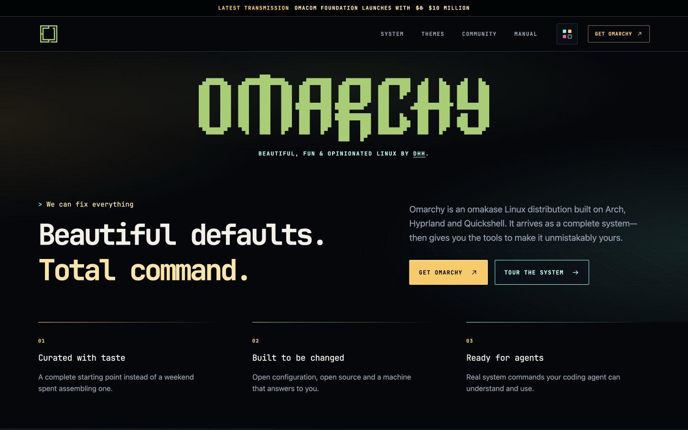

# Omarchy — The Sovereign Machine

An independent homepage redesign proposal by [Rudy Rodriguez](https://rudyr.com),
built on the official [Omarchy website](https://github.com/omacom/omarchy-site).
This is not the official Omarchy site and is not endorsed by Omacom or 37signals.

**Beautiful defaults. Total command.**

[Live preview](https://omarchy.rudyr.com/) ·
[Pages fallback](https://omarchy-sovereign-machine.pages.dev/) ·
[Case study](docs/CASE-STUDY.md) · [Implementation notes](IMPLEMENTATION-NOTES.md)



## The direction

A regal retro-futurist operating-system aesthetic: part early-'80s computer lab,
part neon digital realm. Black glass, Omarchy green, phosphor cyan, warm signal
gold, fine circuitry and precise alignment give the page its character. Open
layouts keep that precision from becoming a box around every section.

The introduction leads straight into all five featured videos, followed by one
interactive system workspace, real theme previews, documented commands and the
community. Text, navigation, controls and terminal output are code-native.

## Run locally

Ruby is sufficient; there is no framework, package installation or build step.

```sh
git clone https://github.com/rodrix2000/omarchy-sovereign-machine.git
cd omarchy-sovereign-machine
ruby bin/serve 4173
```

Open <http://localhost:4173/>. Keep the local server on localhost; it is a
development tool, not a production server.

## Implementation

- Static semantic HTML, modular CSS and small ES modules.
- No runtime dependencies, remote web fonts or framework migration.
- All content and links remain available without JavaScript.
- Reduced-motion support, keyboard navigation and visible focus states.
- Responsive layouts verified at 1440px and 390px, with intermediate checks.
- Video posters load a player only after activation; other videos remain links.

The main changes are in `index.html`, `assets/css/home.css`, and
`assets/js/modules/home.js`. Existing public routes and upstream history remain.
See [the original upstream README](docs/UPSTREAM-README.md) for theme submissions.

## Verify and deploy

```sh
ruby bin/check
npx --yes html-validate@10.4.0 index.html
git push origin design/sovereign-machine-homepage
```

After committing reviewed changes, pushing the design branch automatically
validates and deploys to Cloudflare Pages through GitHub Actions. Pull requests
validate only. The workflow publishes the exact checked, allowlisted package to
the separate `omarchy-sovereign-machine` Pages project, never the repository
root, and verifies the live homepage matches. Credentials stay in GitHub's
encrypted secrets. The manual fallback is `ruby bin/deploy-preview` with an
authorized Cloudflare login. See [DEPLOYMENT.md](DEPLOYMENT.md) for release
status, credential setup, fork configuration and rollback.

## License and attribution

**This is a mixed-rights repository, not a blanket MIT relicensing of Omarchy.**
Rudy's original redesign code, tooling and documentation are offered under MIT.
Upstream website content, Omarchy branding, the Omarchs jester and other
third-party media are excluded from that grant. The website and Omarchs
repositories did not declare a general license when audited on 2026-08-30.

JetBrains Mono remains under SIL OFL 1.1; the inherited TTFX engine remains MIT
with its original copyright notices. The Omarchy distribution's MIT license
does not automatically establish the website's or artwork's license.

Read [LICENSE.md](LICENSE.md) and [THIRD-PARTY-NOTICES.md](THIRD-PARTY-NOTICES.md)
before reusing material. Omarchy names and marks remain their owners' property;
no trademark rights or endorsement are granted.

---

## Upstream project

Beautiful, Fun & Opinionated Linux by DHH.

See https://github.com/omacom/omarchy for more.

## Adding your theme

Community themes are listed on [omarchy.org/themes](https://omarchy.org/themes/).
To get yours on the page, open a pull request with two things.

**1. A screenshot.** Take a 16:9 shot of the theme on a real desktop, then
convert it:

    magick preview.png -strip -resize '1200>' -quality 80 your-theme.webp

Put the result in `assets/themes/`. Name the file after the theme, lowercase
and hyphenated — `your-theme.webp`. Aim for 1200x675; keep it under about
100KB so the page stays quick to load.

**2. An entry.** Add a figure block to `themes/index.html`, in alphabetical
order among the others:

```html
<figure class="themes__theme">
  <a href="https://github.com/you/your-theme"></a>
  <figcaption><a href="https://github.com/you/your-theme">Your Theme</a></figcaption>
</figure>
```

Both links point at the theme's own repository, which is where people
install it from and where it needs to keep living.

### The screenshot matters

The page is a grid of screenshots — that image is the whole pitch for your
theme, so give it the same care you gave the palette. Show a real session
with a terminal and an editor in it, not an empty desktop. Use the theme's own
wallpaper. Don't scale a small capture up, and don't include a cursor, a
notification, or anything personal you'd rather not publish.

Pull requests without a screenshot can't be merged, because there's nothing
to put on the page.

## Plugins

Plugins aren't in this repository. They're listed on
[omarchyplugins.com](https://omarchyplugins.com/) from the
[marketplace repo](https://github.com/HANCORE-linux/omarchy-plugin-marketplace),
which has its own submission guide.
