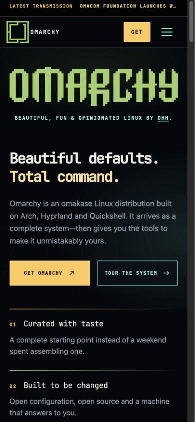

# The Sovereign Machine

**Beautiful defaults. Total command.**

[Live preview](https://omarchy.rudyr.com/) · [Repository](https://github.com/rodrix2000/omarchy-sovereign-machine)

## The idea

Omarchy has grown beyond a launch page: themes, plugins, agents, workstations,
news and community now deserve a clear path. This independent redesign lets the
product supply the visual language. Tiling becomes alignment, theme propagation
becomes interaction, and the command center becomes the agent story.

The aesthetic imagines a premium personal-computing system conceived in the
early 1980s and completed today: black glass, phosphor cyan, signal gold, fine
circuitry and the official green Omarchy wordmark. It is playful and confident
without turning the page into a fictional game interface.

## Open desktop, precise system

The first version leaned heavily on frames. The final pass opens the hero,
principles, video gallery, theme preview and community directory. The design
keeps angular precision, but reserves boxes for actual terminal/workspace UI.
Static section gradients alternate through colored darkness without adding
motion, large background images or a runtime dependency.

The story flows from introduction to proof and then control:

1. Official identity, the promise, and three open principles.
2. All five videos, with a large introduction and four related posters.
3. One interactive workspace with terminal/editor/browser focus.
4. Real theme screenshots and an accessible palette selector.
5. Documented commands that explain agent-friendly system control.
6. Explore/community links, the Omarch coda and complete credits.

## Built in the existing architecture

The project remains static HTML, modular CSS and small ES modules. Navigation,
terminal output, controls and copy remain code-native. The page introduces no
framework migration, package manifest or production dependencies.

Without JavaScript, every section and destination remains available, including
the native mobile menu and direct video links. Reduced-motion users skip the
finite boot/replay presentation. Interactions communicate state through labels
and accessible attributes, not animation alone.

## Responsive evidence

The mobile layout becomes linear without losing the official identity, strong
actions or early video proof. The system controls remain usable, theme content
stays readable and the long page retains a clear rhythm.

## Credits and reuse

This is a proposal by Rudy Rodriguez, based on `omacom/omarchy-site`; it is not
endorsed by Omacom or 37signals. Official marks, media, the Omarchs jester and
third-party fonts retain their own rights. Original redesign contributions are
MIT-licensed, with scope and exceptions in [LICENSE.md](../LICENSE.md).
